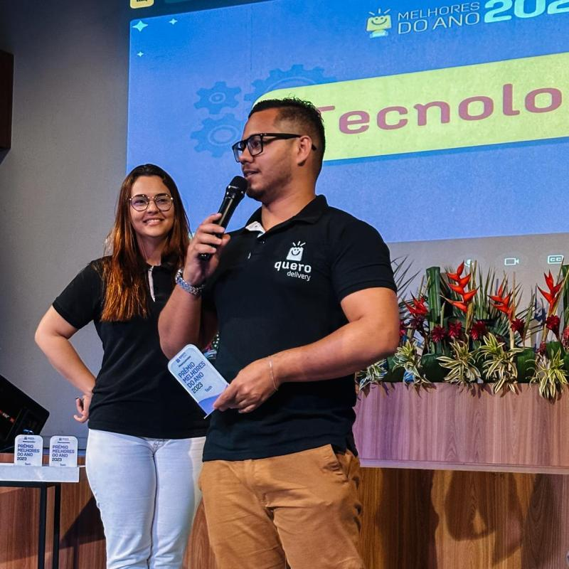
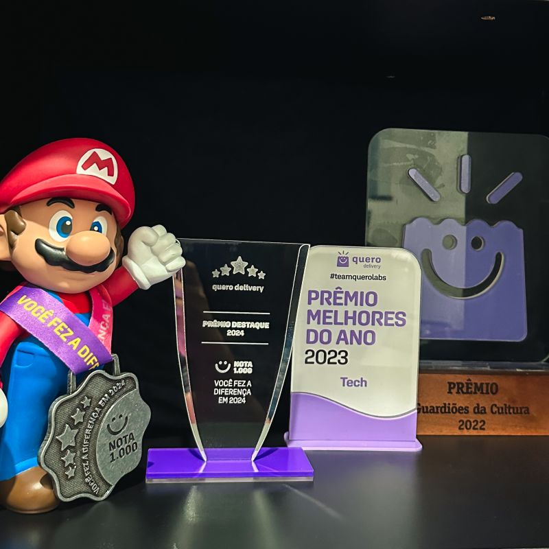
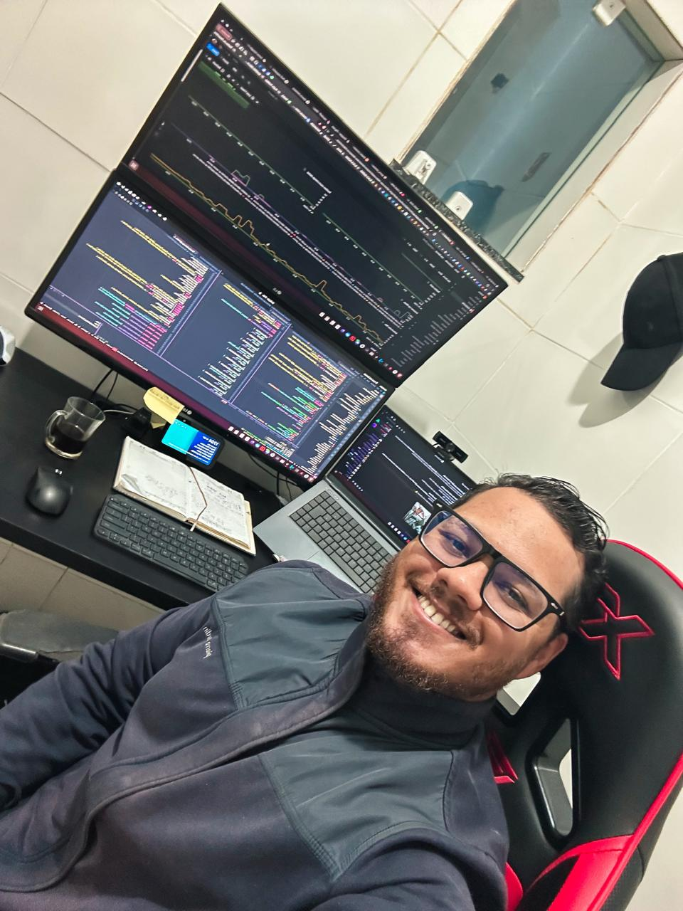
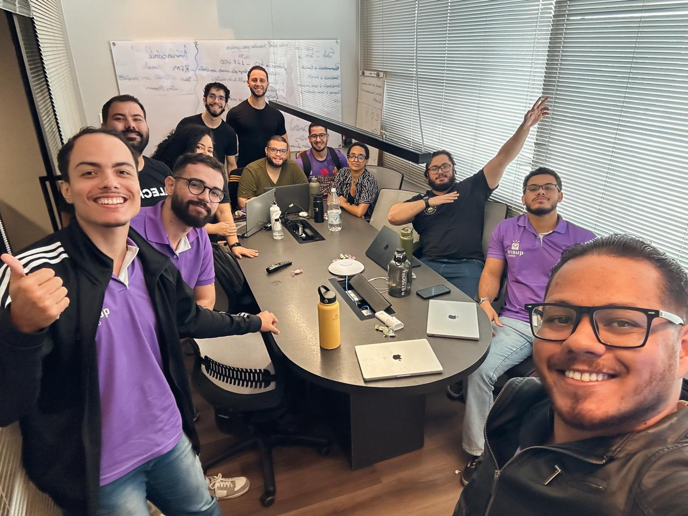
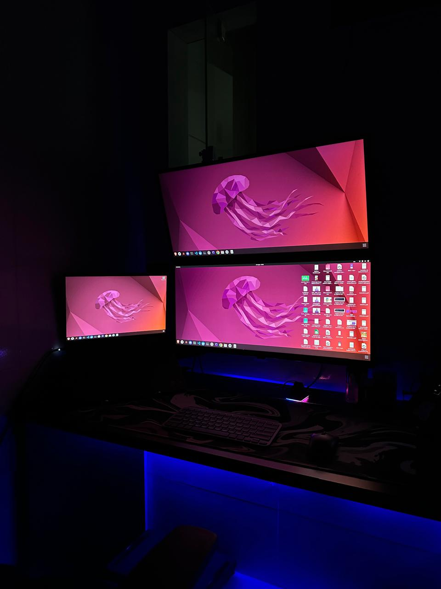

# Olá, eu sou Plínio Augusto 👋

### Tech Lead e Desenvolvedor Back-end focado em pessoas, produto e sistemas escaláveis

Atuo como Tech Lead conectando pessoas, produto e tecnologia para transformar requisitos complexos em soluções back-end confiáveis.

## 🚀 Atuação como Tech Lead

- 🎯 Lidero iniciativas técnicas alinhando arquitetura, prioridades de negócio e evolução do produto
- 🤝 Apoio o time com planejamento de sprints, delegação de tarefas, acompanhamento técnico e desenvolvimento contínuo
- 💬 Facilito comunicação entre pessoas técnicas e não técnicas, traduzindo complexidade em decisões claras
- 🧠 Promovo colaboração por meio de revisão de código, programação em par, documentação e troca de conhecimento
- 🧩 Contribuo para padrões internos de arquitetura, codificação e comunicação entre serviços

## 👨‍💻 Sobre mim

- 💼 Desenvolvedor de software na [Quero Delivery](https://querodelivery.com/)
- 🎓 Pós-graduando em Arquitetura de Software
- ⚙️ Desenvolvedor com foco em back-end, atuando com Node.js, TypeScript, JavaScript e Java
- 📡 Experiência com APIs, microsserviços, monólitos, mensageria, cache e monitoramento em produção
- 🏗️ Interesse em arquitetura de software, sistemas distribuídos, visão de produto e impacto no negócio
- ✨ Gosto de transformar requisitos complexos em soluções simples, escaláveis e fáceis de manter

## 🛠️ O que eu faço

- 🏛️ Defino arquitetura de serviços, fluxos de comunicação e padrões técnicos para sistemas distribuídos
- 🔌 Crio e mantenho serviços back-end, APIs e integrações com foco em escalabilidade e confiabilidade
- ⚡ Implemento mensageria assíncrona com Kafka, estratégias de cache com Redis e consultas eficientes
- ✅ Melhoro a qualidade do código com testes automatizados, revisão de código e documentação clara
- 📈 Monitoro sistemas em produção, investigo problemas e atuo de forma proativa para manter os serviços estáveis

## 📸 Momentos de trabalho

  <table>
    <tr>
      <td width="33%" align="center">
        
         
        <b>Prêmio Melhores do Ano 2023 - Back-end</b>
      </td>
      <td width="33%" align="center">
        
         
        <b>Algumas das premiações recebidas</b>
      </td>
      <td width="33%" align="center">
        
         
        <b>Trabalho no dia a dia</b>
      </td>
    </tr>
  </table>
  <table>
    <tr>
      <td width="50%" align="center">
        
         
        <b>Reunião de tech leaders 2026-2</b>
      </td>
      <td width="50%" align="center">
        
         
        <b>Estação de trabalho - Setup</b>
      </td>
    </tr>
  </table>

## Reconhecimentos

- **2022 - Guardiões da Cultura:** reconhecimento por fortalecer valores e cultura organizacional
- **2023 - Melhores do Ano - Back-end:** destaque por excelência técnica e impacto nas soluções desenvolvidas
- **PDI - Sou melhor a cada dia:** compromisso com evolução contínua, aprendizado e desenvolvimento profissional

## Tecnologias e ferramentas

| Back-end                                                  | Arquitetura                                                               | Dados e mensageria                       | Qualidade e entrega                                         |
| --------------------------------------------------------- | -------------------------------------------------------------------------- | ---------------------------------------- | ----------------------------------------------------------- |
| Node.js, TypeScript, JavaScript, Java, Express, APIs REST | Arquitetura Hexagonal, DDD, monólitos, microsserviços, sistemas distribuídos | MongoDB, PostgreSQL, MySQL, Redis, Kafka | Jest, Mocha, Chai, Docker, Git, GitHub, Jira, Kanban, Ágil |

  

## Foco atual

- Projetar serviços back-end claros, escaláveis e fáceis de evoluir
- Fortalecer liderança técnica, comunicação, colaboração e autonomia do time
- Melhorar a qualidade de APIs, observabilidade, cobertura de testes e confiabilidade em produção
- Contribuir com padrões internos de engenharia e compartilhamento de conhecimento

## Vamos conversar

Estou sempre aberto a conversas sobre engenharia back-end, tecnologia, produto e negócios.
